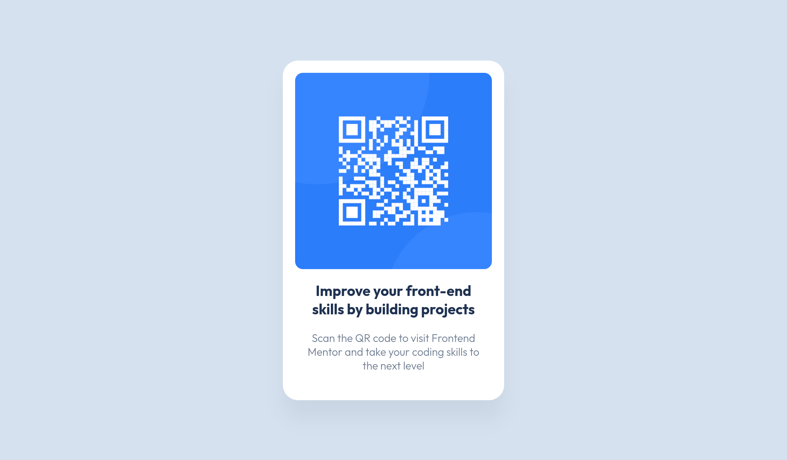

# Frontend Mentor - QR code component solution

This is a solution to the [QR code component challenge on Frontend Mentor](https://www.frontendmentor.io/challenges/qr-code-component-iux_sIO_H). Frontend Mentor challenges help you improve your coding skills by building realistic projects. 

## Table of contents

- [Overview](#overview)
  - [Screenshot](#screenshot)
  - [Links](#links)
- [My process](#my-process)
  - [Built with](#built-with)  
- [Author](#author) 

## Overview

### Screenshot

 

### Links

- Solution URL: [Github Repo](https://github.com/shad0w-max/qr-code-component)
- Live Site URL: [Vercel Link](https://qr-code-component-eta-orpin.vercel.app/)

## My process

### Built with

- Semantic HTML5 markup
- CSS custom properties
- Flexbox    

## Author

- Github - [Great Ezenna](https://github.com/shad0w-max)
- Frontend Mentor - [@shad0w-max](https://www.frontendmentor.io/profile/shad0w-max)
- X(formerly Twitter) - [@shad0w_max](https://x.com/shad0w_max) 